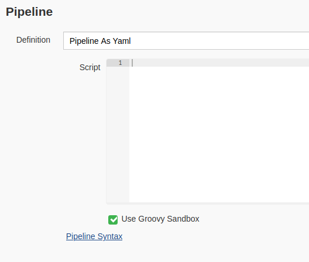
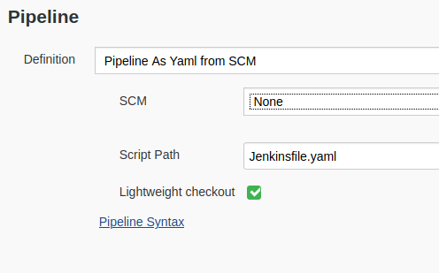
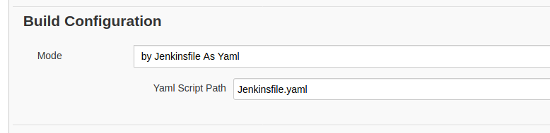
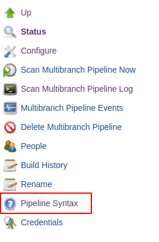
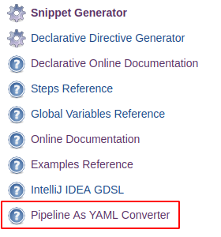
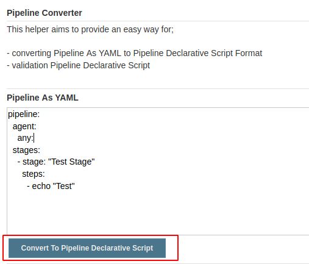
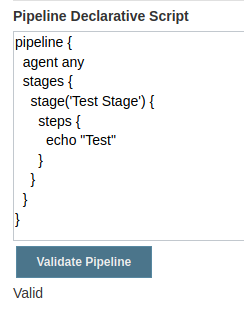

Pipeline As Yaml Plugin for Jenkins (Incubating)
=======================

This plugin enables defining Jenkins Pipelines in YAML Format for Pipeline and MultiBranch Pipeline Jobs.

:exclamation: **Incubation Stage**: Currently this plugin is in the incubation stage.
It will evolve further to become more aligned with the Pipeline ecosystem, and some breaking changes are plausible.
You are welcome to try out this plugin and to provide your feedback.
Contributions are welcome!

# Description
Jenkins enables defining pipelines with specific DSL. With this plugin Jenkins pipelines can be defined in Yaml format.

Defined Yaml format is converted to Jenkins Pipeline Declarative syntax in runtime. 

**Any existing steps in [Snippet Generator](https://jenkins.io/doc/book/pipeline/getting-started/#snippet-generator) 
or [Declarative Directive Generator](https://jenkins.io/doc/book/pipeline/getting-started/#directive-generator) can bu used in `step` or `script` block.** 

[Jenkins Declarative Pipeline Syntax](https://jenkins.io/doc/book/pipeline/syntax/) rules must be followed. 

Please see below for usage examples.

## Usage

### Pipeline
For using Pipeline As Yaml in your Pipeline Job, select one of the possible options.

#### Editor
Define Pipeline As Yaml with embedded editor.



#### SCM
Retrieve Pipeline As Yaml from SCM Definition



### MultiBranch Pipeline
For using Pipeline as Yaml in your MultiBranch Pipeline, select `by Jenkinsfile As Yaml' in `Build Configuration`.



## Pipeline As Yaml Syntax

Pipeline definition must stat with `pipeline` key.

[For detailed usage examples please check here.](./src/test/resources/job)
```yaml
pipeline:
  agent: any
    ...
    ...
```

### Agent
Example agent definition is shown below. Agent definitions can be used under `stage` definitions.

[For further supported definitions syntax please check.](./src/test/resources/agent)
```yaml
pipeline:
  agent:
    node:
      label: 'label'
```

### Environment
Example definition is shown below. Environment definitions can be used under `stage` definitions.

[For further supported definitions syntax please check.](./src/test/resources/environment)
```yaml
pipeline:
  environment:
    KEY1: "VAL1"
```

### Options
Example definition is shown below. Options definitions can be used under `stage` definitions.

[For further supported definitions syntax please check.](./src/test/resources/options)
```yaml
pipeline:
  options:
    - "timeout(time: 1, unit: 'HOURS')"
    # Or any other 'options' directive which is generated by Declarative Directive Generator
```

### Post
Example definition is shown below. Post definitions can be used under `stage` definitions.

[For further supported definitions syntax please check.](./src/test/resources/post)
```yaml
pipeline:
  post:
    always:
      - echo Test
    changed:
      - echo Test
    # Or any other 'post' directive which is generated by Declarative Directive Generator 
```

### Tools
Example definition is shown below. Tools definitions can be used under `stage` definitions.

[For further supported definitions syntax please check.](./src/test/resources/tools)
```yaml
pipeline: 
  tools:
    maven: "maven"
    # Or any other 'tools' directive which is generated by Declarative Directive Generator" 
```

### When
Example definition is shown below. When definitions can be used under `stage` definitions.

[For further supported definitions syntax please check.](./src/test/resources/when)
```yaml
pipeline:
  stages:
    - stage: "WhenTest"
      when:
        - "branch 'production'"
      # Or any other 'when' directive which is generated by Declarative Directive Generator" 
```

### Parameters
Example definition is shown below.

[For further supported definitions syntax please check.](./src/test/resources/parameters)
```yaml
pipeline:
  parameters:
    - "string(name: 'PERSON', defaultValue: 'Mr Jenkins', description: 'Who should I say hello to?')"
    # Or any other 'parameters' directive which is generated by Declarative Directive Generator" 
```

### Triggers
Example definition is shown below.

[For further supported definitions syntax please check.](./src/test/resources/triggers)
```yaml
pipeline:
  triggers:
    - cron('H */4 * * 1-5')
    # Or any other 'triggers' directive which is generated by Declarative Directive Generator" 
```

### Library
Example definition is below. 

Before using Library feature please read [here](https://www.jenkins.io/doc/book/pipeline/shared-libraries/)

[For further supported definitions syntax please check.](./src/test/resources/library)
```yaml
pipeline:
  library: "library@master"
  agent:
    any:
  stages:
    - stage: "Stage Library"
      steps:
        script:
          - "myCustomStepInLibrary"
```

### Stages
Example definition is shown below.

[For further supported definitions syntax please check.](./src/test/resources/stages)
```yaml
pipeline:
  agent:
    none:
  stages:
    - stage: "Stage1"
      steps:
        - echo "1"
    - stage: "Stage2"
      steps:
        - echo "2"
```

```yaml
pipeline:
  agent:
    none:
  stages:
    - stage: "Stage1"
      stages:
        - stage: "Inner Stage1"
          steps:
            - echo "1" 
```

```yaml
pipeline:
  stages:
    - stage: "Stage1"
      steps:
        - echo "1"
    - stage: "Parallel"
      parallel:
        - stage: "Parallel1"
          steps:
            - echo "P1"
        - stage: "Parallel2"
          steps:
            - echo "P1"
```

### Steps
Example definition is shown below.

**Any other 'step' which is generated by Snippet Generator can be used in steps definitions.**

[For further supported definitions syntax please check.](./src/test/resources/steps)
```yaml
pipeline:
  stages:
    - stage: "Stage"
      steps:
        - echo env.WORKSPACE # Or any other 'step' which is generated by Snippet Generator" 
```

**Any other 'step' which is generated by Snippet Generator or Groovy Script can be used in steps definitions.**
```yaml
pipeline:
  stages:
    - stage: "Stage1"
      steps:
        script:
          - echo "1" # Or any other 'step' which is generated by Snippet Generator, Groovy Script" 
```

For implementing complex scripts or steps

```yaml
pipeline:
  stages:
    - stage: "Stage1"
      steps:
        script: |
          echo "1"
          echo "2"
          echo "3"
```

### Special Steps With Code Blocks
Some steps has their own code blocks. For example: 'withAnt, withEnv, withCredentials, dir' or any other custom step
definition which has it's own code block. 

This kind of steps also can be defined as YAML. 

Example definition is shown below.
```yaml
pipeline:
  stages:
    - stage: "Stage"
      steps:
        script:
          - withAnt:
            script:
              - echo "No values"
          - withEnv: "['KEY=VAL']"
            script:
              - echo $KEY
          - withCredentials: "[usernamePassword(credentialsId: 'eedc7820-a4e0-4d87-a66d-b5b65ee42ad9', passwordVariable: 'PASSWORD', usernameVariable: 'USERNAME')]"
            script:
              - echo $USERNAME
          - withCredentials: "[string(credentials: ''),variable: 'CRED']"
            script:
              - echo $CRED
```
This steps can be used within their blocks as well.
```yaml
pipeline:
  stages:
    - stage: "WithEnv Intertwined"
      steps:
        script:
          - withEnv: "['KEY1=VAL1']"
            script:
              - echo env.KEY1
              - withEnv: "['KEY2=VAL2']"
                script:
                  - echo env.KEY2
```

Custom steps can be converted to YAML format as shown below.

```groovy
myCustomStep([customVariable: '']) {
    echo "some code"
}
```
```yaml
pipeline:
  stages:
    - stage: "Stage"
      steps:
        script:
          - myCustomStep: "[customVariable: '']"
            script:
              - echo "some code"

```

Conversion and Validation
=========================
Before running Pipeline As Yaml, you can convert to Declarative Script and validate the pipeline.
By this, errors can be prevented before running the pipelines.

For using this functionality click the Pipeline Syntax Page which is shown in the Job Menu



Click "Pipeline As YAML Converter" link



Paste your Pipeline As YAML to first text area and click "Convert To Pipeline Declarative Script" button as shown below



After successful conversion second text area will be filled Pipeline Declarative Script.
For validation, click "Validate" button as shown below



Validation or error messages will be show below the button.

Reporting Issues
================
Please create issue in this repository.

[Create Issue](https://github.com/jenkinsci/pipeline-as-yaml-plugin/issues/new/choose)

Thank You!
==========
If you feel your self generous today, you can buy me a coffee : )
<br>
Or you can star the project.
Thanks.
<br>
<br>
<div align="center">
    <a href="https://www.buymeacoffee.com/STiAsoy" target="_blank">
        
    </a>
</div>

